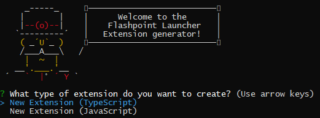

# Yo FPL - Extension and Customization Generator

[](https://github.com/FlashpointProject/generator-fpl/actions)

This is an extension generator written for Yeoman with the work of Microsoft's vscode-generator-code used as a starting point.

The FPL Extensions system wouldn't be possible without the work of VSCode's own extensions system.

[Visual Studio Code](https://github.com/microsoft/vscode)

[VSCode Extension Generator](https://github.com/microsoft/vscode-generator-code)

## Install the Generator

Install Yeoman and the Flashpoint Project Extension generator:

```bash
npm install -g yo generator-fpl
```

## Run Yo Code
The Yeoman generator will walk you through the steps required to create your customization or extension prompting for the required information.

To launch the generator simply type:

```bash
yo fpl
```



## Generator Output

These templates will
* Create a base folder structure
* Template out a rough `package.json`

## Command line

```
Usage:
  yo fpl [<destination>] [options]

Generates a Flashpoint Launcher extension ready for development.

Options:
  -h,   --help                  # Print the generator's options and usage
        --skip-cache            # Do not remember prompt answers                          Default: false
        --skip-install          # Do not automatically install dependencies               Default: false
        --force-install         # Fail on install dependencies error                      Default: false
        --ask-answered          # Show prompts for already configured options             Default: false
  -q,   --quick                 # Quick mode, skip all optional prompts and use defaults
  -t,   --extensionType         # ts, js...
  -n,   --extensionDisplayName  # Display name of the extension
        --extensionId           # Id of the extension
        --extensionDescription  # Description of the extension
        --pkgManager            # 'npm' or 'yarn'
        --webpack               # Bundle the extension with webpack
        --gitInit               # Initialize a git repo

Arguments:
  destination  #
    The folder to create the extension in, absolute or relative to the current working directory.
    Use '.' for the current folder. If not provided, defaults to a folder with the extension display name.
    Type: String  Required: false

Example usages:
  yo fpl                       # Create an extension in a folder with the extension's name as prompted in the generator.
  yo fpl . -O                  # Create an extension in current folder and open with vscode
  yo fpl Hello -t=ts -q        # Create an TypeScript extension in './Hello', skip prompts, use defaults.
```

## Run Generator using Docker

If you don't want to install nodejs or any node packages, use this method to containerize the generator. \
\
Go into your project directory
```bash
cd <project directory>
```
Build the docker image from the docker file
```bash
docker build -t generator-fpl .
```
Create a docker container with volumes
```bash
docker run -v $(pwd):/usr/src/app generator-fpl
```

## Local development

After making necessary changes, run `npm link` before running `yo code` to
test the local version.

You can learn more about Yeoman generator development on its
[documentation website](https://yeoman.io/authoring/index.html).

## History

* 1.6.10 Added Templates: Command TS, Command TS w/ Webpack, Command JS

## License

[MIT](LICENSE)

[Third Party Licenses](thirdpartynotices.txt)
